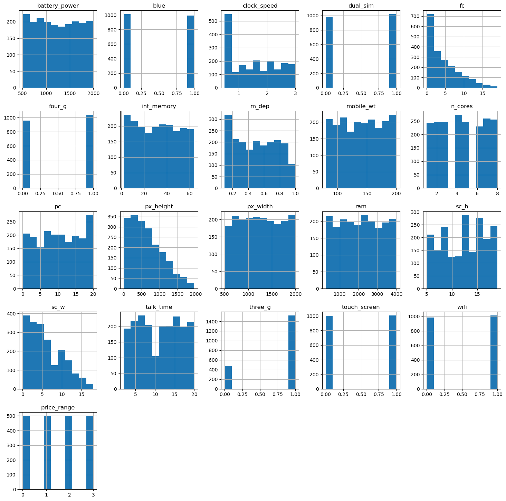
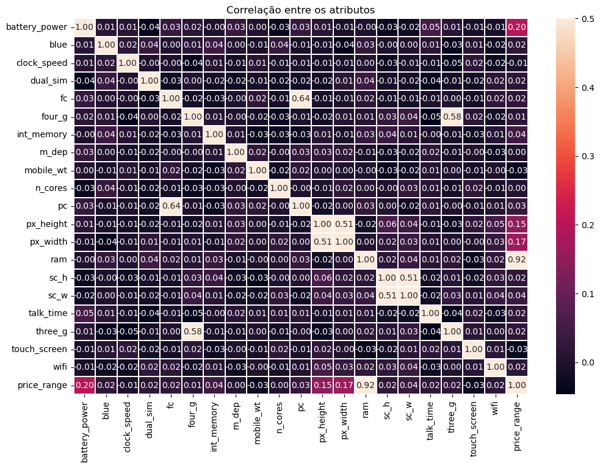

# Decision-Tree-Classification
Utilização do banco de dados “mobile-price” para abordar o problema de classificação utilizando uma árvore de decisão com o método de validação cruzada k-Fold para avaliar o treinamento do modelo.
 
<font size="3"><b> Importação do banco de dados "mobile-price" para classificação utilizando Árvore de decisão com método de validação cruzada k-fold.</b>  </font>  

O banco de dados contém informações sobre os recursos de celulares e seu preço de venda organizado em faixa de valores (0 - 3), 0 para o mais barato até 3 para o preço mais caro. Então, o objetivo é prever uma faixa de preço para novos celulares.


```python
import pandas as pd
import numpy as np
import matplotlib.pyplot as plt
import seaborn as sns
from sklearn.model_selection import train_test_split
from statistics import mean
from sklearn.metrics import accuracy_score 
from sklearn.metrics import explained_variance_score as evs
from sklearn.metrics import mean_squared_error
from sklearn.metrics import ConfusionMatrixDisplay, classification_report

dados = pd.read_csv('./mobile-price.csv')

print("Quantidade de objetos do banco de dados:", dados.shape[0])
print("Quantidade de atributos do banco de dados:", dados.shape[1])

dados.sample(5)
```

    Quantidade de objetos do banco de dados: 2000
    Quantidade de atributos do banco de dados: 21
    


<div>

<table border="1" class="dataframe">
  <thead>
    <tr style="text-align: right;">
      <th></th>
      <th>battery_power</th>
      <th>blue</th>
      <th>clock_speed</th>
      <th>dual_sim</th>
      <th>fc</th>
      <th>four_g</th>
      <th>int_memory</th>
      <th>m_dep</th>
      <th>mobile_wt</th>
      <th>n_cores</th>
      <th>...</th>
      <th>px_height</th>
      <th>px_width</th>
      <th>ram</th>
      <th>sc_h</th>
      <th>sc_w</th>
      <th>talk_time</th>
      <th>three_g</th>
      <th>touch_screen</th>
      <th>wifi</th>
      <th>price_range</th>
    </tr>
  </thead>
  <tbody>
    <tr>
      <th>482</th>
      <td>1330</td>
      <td>1</td>
      <td>1.3</td>
      <td>1</td>
      <td>14</td>
      <td>0</td>
      <td>3</td>
      <td>0.3</td>
      <td>83</td>
      <td>5</td>
      <td>...</td>
      <td>980</td>
      <td>1262</td>
      <td>463</td>
      <td>14</td>
      <td>6</td>
      <td>11</td>
      <td>0</td>
      <td>0</td>
      <td>1</td>
      <td>0</td>
    </tr>
    <tr>
      <th>852</th>
      <td>814</td>
      <td>1</td>
      <td>1.1</td>
      <td>1</td>
      <td>2</td>
      <td>0</td>
      <td>41</td>
      <td>0.8</td>
      <td>177</td>
      <td>2</td>
      <td>...</td>
      <td>1092</td>
      <td>1406</td>
      <td>1944</td>
      <td>16</td>
      <td>6</td>
      <td>12</td>
      <td>1</td>
      <td>0</td>
      <td>0</td>
      <td>1</td>
    </tr>
    <tr>
      <th>1159</th>
      <td>504</td>
      <td>0</td>
      <td>2.8</td>
      <td>1</td>
      <td>0</td>
      <td>0</td>
      <td>40</td>
      <td>0.5</td>
      <td>178</td>
      <td>3</td>
      <td>...</td>
      <td>626</td>
      <td>1195</td>
      <td>470</td>
      <td>6</td>
      <td>0</td>
      <td>16</td>
      <td>1</td>
      <td>0</td>
      <td>0</td>
      <td>0</td>
    </tr>
    <tr>
      <th>774</th>
      <td>969</td>
      <td>0</td>
      <td>2.4</td>
      <td>0</td>
      <td>0</td>
      <td>0</td>
      <td>45</td>
      <td>0.3</td>
      <td>124</td>
      <td>7</td>
      <td>...</td>
      <td>491</td>
      <td>589</td>
      <td>404</td>
      <td>18</td>
      <td>5</td>
      <td>19</td>
      <td>1</td>
      <td>0</td>
      <td>1</td>
      <td>0</td>
    </tr>
    <tr>
      <th>1254</th>
      <td>1083</td>
      <td>0</td>
      <td>1.0</td>
      <td>0</td>
      <td>6</td>
      <td>0</td>
      <td>52</td>
      <td>0.9</td>
      <td>126</td>
      <td>2</td>
      <td>...</td>
      <td>925</td>
      <td>1469</td>
      <td>681</td>
      <td>19</td>
      <td>18</td>
      <td>19</td>
      <td>1</td>
      <td>1</td>
      <td>1</td>
      <td>0</td>
    </tr>
  </tbody>
</table>
<p>5 rows × 21 columns</p>
</div>


 <br>
<font size="4">  
    <b >Checando se tem valores faltando</b>
</font> 


```python
dados.isnull().sum()
```


    battery_power    0
    blue             0
    clock_speed      0
    dual_sim         0
    fc               0
    four_g           0
    int_memory       0
    m_dep            0
    mobile_wt        0
    n_cores          0
    pc               0
    px_height        0
    px_width         0
    ram              0
    sc_h             0
    sc_w             0
    talk_time        0
    three_g          0
    touch_screen     0
    wifi             0
    price_range      0
    dtype: int64


Não há valores ausentes

 <br>
<font size="4">  
    <b >Histograma dos atributos</b>
</font> 


```python
dados.hist(figsize=(18,18))
plt.show()
```


    

    


 <br>
<font size="4">  
    <b >Checando a distribuição do atributo alvo</b>
</font> 


```python
fig1,histogramaPreco = plt.subplots(figsize=(4,3))
sns.countplot(x = dados['price_range'])
histogramaPreco.set_xlabel('Faixa de preço')
histogramaPreco.set_ylabel('Quantidade')
histogramaPreco.set_title('Atributo alvo: price_range')
```


    Text(0.5, 1.0, 'Atributo alvo: price_range')


    

    


Com o histograma acima podemos observar que a classe alvo está igualmente distribuida.

 <br>
<font size="4">  
    <b >Correlação dos atributos</b>
</font> 


```python
plt.figure(figsize=(12,8))
sns.heatmap(dados.corr(), vmax=.5, annot=True, fmt='.2f', linewidths=.1,)
plt.title('Correlação entre os atributos')
plt.show()
```


    

    


Com o gráfico acima, podemos observar que os atributos com as maiores correlações com o atributo alvo (price_range):

ram: 0.92

battery_power: 0.20

px_width: 0.17

px_height: 0.15


 <br>
<font size="4">  
    <b>Boxplot dos atributos</b>
</font> 

Separação dos atributos numéricos do banco de dados:


```python
num_cols = pd.DataFrame (x, columns= ['battery_power', 'clock_speed', 'fc', 'int_memory', 'm_dep', 'mobile_wt', 'pc', 'px_height', 'px_width', 'ram', 'sc_h', 'sc_w', 'talk_time'])
```


```python
sns.set_style('darkgrid')
fig, axs = plt.subplots(5, 3, sharey=True, figsize=(13,7))
axs = axs.flatten()

for i, data in enumerate(num_cols):
    sns.boxplot(data=x[data], orient='h', color ='#6fcfbc', ax=axs[i])
    axs[i].set_title(data)
        
plt.tight_layout()

```


    

    


Com os gráficos dos boxsplots, conseguimos visualizar presença de outliers nos atributos "px_height" e"fc". Para o atributo "sc_w" não consta outliers, mas o limite superior está distante do 3º quartil, podendo contém também outliers.

A correlação dos atributos "fc" e "sc_w" com o atributo alvo para a classificação é pequena. Porém, para o atributo "px_height" é a quarta maior correlação, assim podendo influenciar no desempenho do modelo.

 <br>
<font size="4">  
    <b >Separação do atributo alvo</b>
</font> 


```python
y = dados['price_range']
x = dados.drop(['price_range'], axis = 1)
```

<br>
<font size="4">  
    <b>Separação 70% do banco de dados para treinamento e 30% para teste</b>
</font> 


```python
train_X, test_X, train_y, test_y = train_test_split(x, y, test_size = 0.3, random_state = 0)
```

<br>
<font size="4">  
    <b>Validação cruzada k-fold, com 5 partições (k = 5)</b>
</font> 


```python
from sklearn import tree
from sklearn.model_selection import cross_val_score
from sklearn.model_selection import KFold

modelo = tree.DecisionTreeClassifier()

k = 5
kfold  = KFold(n_splits = k , shuffle=True)

scores = cross_val_score(modelo, train_X, train_y, cv=kfold, scoring='accuracy')
print("Lista de acurácias:\n", scores)  
print("Acurácia média: ", scores.mean())
```

    Lista de acurácias:
     [0.74642857 0.85357143 0.83928571 0.83571429 0.82857143]
    Acurácia média:  0.8207142857142857
    

<br>
<font size="4">  
    <b>Treinamento do modelo</b>
</font> 


```python
modelo.fit(train_X, train_y)

pred = modelo.predict(test_X)

print("Acurácia com dados de teste:", accuracy_score(test_y, pred))
```

    Acurácia com dados de teste: 0.8383333333333334
    

<br>
<font size="4">  
    <b>Matriz de confusão</b>
</font> 


```python
ConfusionMatrixDisplay.from_estimator(modelo, test_X, test_y, colorbar=True, cmap='Greens')
plt.title('Matriz de confusão')
```


    Text(0.5, 1.0, 'Matriz de confusão')


    

    


A diagonal principal nos mostra a quantidade das predições corretas para cada valor do atributo alvo.

<br>
<font size="4">  
    <b>Precision, Recall, F-measure e Support de cada classe alvo</b>
</font> 


```python
print(classification_report(test_y, pred))
```

                  precision    recall  f1-score   support
    
               0       0.91      0.91      0.91       151
               1       0.76      0.80      0.78       135
               2       0.79      0.74      0.76       151
               3       0.89      0.90      0.89       163
    
        accuracy                           0.84       600
       macro avg       0.84      0.84      0.84       600
    weighted avg       0.84      0.84      0.84       600
    
    

A partir das informações, a precisão nos acertos teve maior destaque na predição correta do atributo alvo "price_range" para os valores 0 e 3.

<br>
<font size="4">  
    <b>Conclusão</b>
</font> 

A máquina de aprendizado treinado obteve uma acurácia média de 82% nas predições corretas. A precisão nos acertos teve maior destaque na predição correta do atributo alvo "price_range" para os valores 0 e 3.
Com os atributos alvos já balanceados, a remoção de outliers dos atributos detectados pode ser feito para melhorar o desempenho do modelo.
